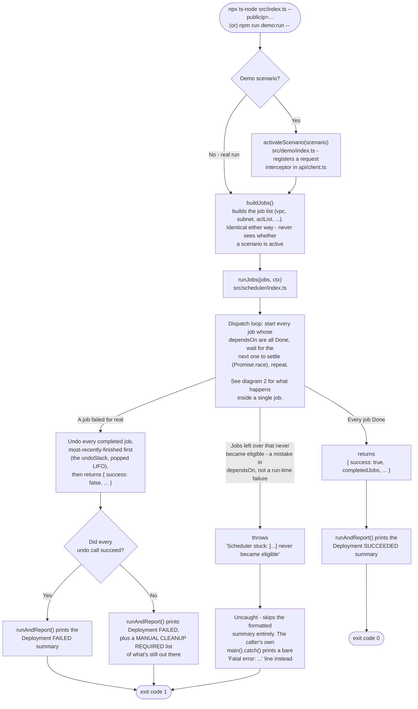
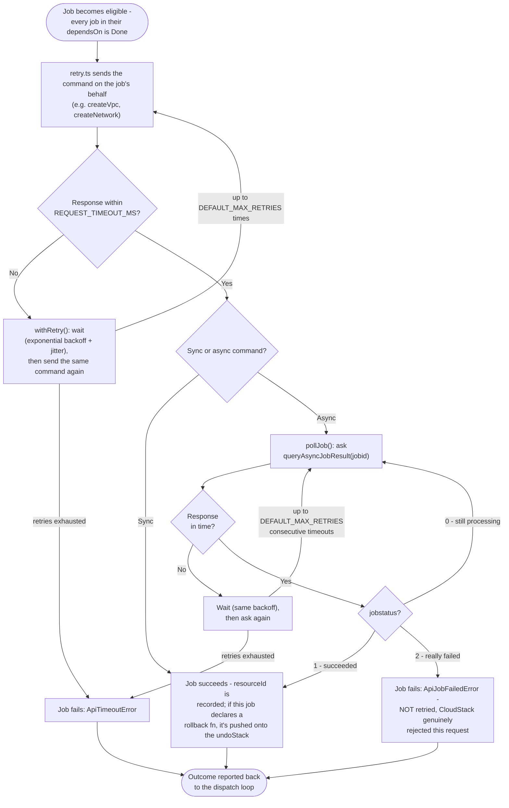

## How it runs
Every job declares which other jobs it needs to finish first (`dependsOn`). Instead of running the job step by step, the scheduler starts a job the instant its own dependencies are done — it never makes a job wait on something unrelated just because that other job happens to be running at the same time.

For example, `aclRule1` only needs `aclList` to be done. It does not wait for `subnet`, even though `subnet` becomes eligible to run around the same time — the two have nothing to do with each other.

| job | needs these done first | how it's undone if the run fails |
| ----------- | ---------------------- | -------------------------------------------------------------------------------------- |
| `vpc`       | *(nothing — starts immediately)* | deletes the VPC |
| `subnet`    | `vpc`                  | deletes the network |
| `aclList`   | `vpc`                  | (removed automatically when the VPC is deleted) |
| `aclRule1`, `aclRule2`, ... | `aclList`              | (removed automatically when the VPC is deleted) |
| `attachAcl` | `aclList`, `subnet`, every `aclRule*`    | (removed automatically when the VPC is deleted) |
| `deployVm`  | `subnet`               | destroys the virtual machine |
| `publicIp`  | *(nothing — starts immediately)* | releases its local claim on the IP (see [docs/local-ip-locking.md](local-ip-locking.md)) |
| `staticNat` | `deployVm`, `publicIp` | disassociates the public IP |

## Project Layout
| path | what it's for |
| ------------------------ | --------------------------------------------------------------------------------------------- |
| `src/index.ts`           | CLI entry: reads `--publicIp`, builds the pipeline, hands off to `runAndReport()` |
| `src/runAndReport.ts`    | Runs the pipeline and prints formatted summary |
| `src/jobs/`              | One file per job — what it needs, what it does, and how to undo it if the run fails |
| `src/demo/`              | Curated demo scenarios (`demo:list` / `demo:run <name>`) - the *only* place demo *behavior* touches the real pipeline is through `api/client.ts` request interceptor. |
| `src/scheduler/index.ts` | The scheduler itself: decides what to run next, and undoes completed work if something fails |
| `src/scheduler/retry.ts` | Retrying a timed-out request, and asking CloudStack whether an in-progress job is done yet |
| `src/scheduler/types.ts` | The shared shapes every job is written against (what a job looks like, what it's given to work with) |
| `src/board/`             | The live status table shown while the run is in progress — `index.ts` draws it, `rows.ts` decides what each row says |
| `src/api/`               | How requests are actually sent to CloudStack and how responses are read |
| `src/errors/`            | The different ways a request can go wrong, and what each one means for retrying |
| `src/ipLock.ts`          | Stops two runs on the same machine from claiming the same public IP at the same time |
| `src/logger.ts`          | Optional: writes every request and response to a file for later review (`CREATE_LOG=true` in `.env`, off by default) |
| `src/config.ts`          | App-level settings only (endpoint, timeouts, retry/backoff, logging), read from `.env` with defaults - not the fake-API fixture values, see `src/demo/fixtures.ts` |

## End-to-end process
Two diagrams, split for a reason: 
- The run's overall lifecycle — what `runJobs()` does from start to exit code. The second zooms into a *single* job's request/retry/poll cycle. 
- Runs independently, once per job, and several of them are in flight at the same time — it's working in parallel.


### 1. The overall run


### 2. One job's lifecycle
Every in-flight job is independently working through this same cycle. A job's `run()` builds `{jobId, command, params}` once and hands it to `runSyncJob()`/`runAsyncJob()` - it never calls the API directly. `withRetry()` and `pollJob()` (both in [`src/scheduler/retry.ts`](../src/scheduler/retry.ts)) own every actual `callApi()` call, retry included; the dispatch loop above just awaits whichever job's promise finishes first.



**What this means in practice:**

- **Jobs run in parallel wherever `dependsOn` allows it.** The moment any job settles, the dispatch loop immediately checks what's newly unblocked and starts it.
- **A timeout is always retried** — both the initial `job.run()` call and every later `queryAsyncJobResult` poll go through the same backoff logic. A real `jobstatus=2` failure is different: CloudStack actually looked at the request and rejected it, so retrying would just get the same rejection again.
- **On a real failure, nothing already in flight is cut off mid-request.** New jobs stop being dispatched, but anything already running is left to finish, so a resource CloudStack already started creating will always tracked.
- **The run ends one of three ways:** 
  - every job succeeds; 
  - a job fails for real and everything already completed gets undone via `undoStack`, most-recently-finished first; 
  - or — separately, and not really a "failure" — some jobs are left with dependencies that can never resolve, which `runJobs()` treats as a thrown error rather than a normal result.
- **Jobs never know whether a demo scenario is active.** `runSyncJob`/`runAsyncJob` pass `{jobId, attempt}` into every `callApi()` call purely as metadata; `callApi()` (`src/api/client.ts`) only ever consults it if something has called `setRequestInterceptor()` first - which nothing in `jobs/`, `scheduler/`, or `api/` itself ever does. Only `src/demo/index.ts`'s `activateScenario()` registers one, and only for the duration of a demo run. That's what lets a scenario like `success-deployvm-recovers-from-timeout` force attempts 1 and 2 to time out and then let attempt 3 through untouched - a real request, which succeeds normally - without a single job file knowing scenarios exist. This is also what makes the pipeline usable as a plain library: `buildJobs()` + `runJobs()` behave identically whether imported directly by another program or run via this CLI, since there's no demo-only parameter threaded through their signatures at all. See [`src/demo/scenarios.ts`](../src/demo/scenarios.ts) for the full scenario list.

## Appendix: running as a subprocess
Not this project's focus (see [README.md](../README.md)), but `runAndReport()` (`src/runAndReport.ts`) - used by both `index.ts` and `demo/run.ts`

```
RESULT_JSON:{"success":true,"completedJobs":[...],"failedJob":null,"rolledBack":[],"rollbackFailed":[],"error":null,"resources":{"vpc":"...","deployVm":"...",...},"cloudJobIds":{...},"elapsedMs":25630}
```

A caller spawning this as a subprocess can rely on the exit code (`0`/`1`) alone, or parse that last line for the full result:

```js
const { stdout, status } = spawnSync("node", ["dist/index.js", "--publicIp=true"]);
const line = stdout.toString().trim().split("\n").pop();
const result = JSON.parse(line.replace("RESULT_JSON:", ""));
// result.success, result.resources.deployVm, result.error, ...
```
